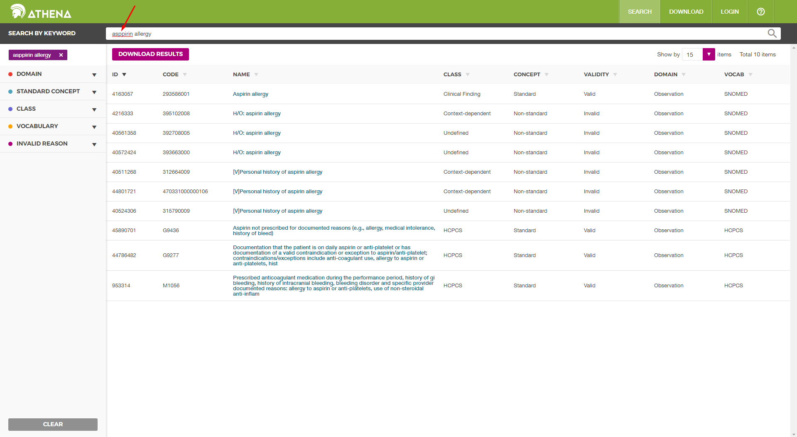
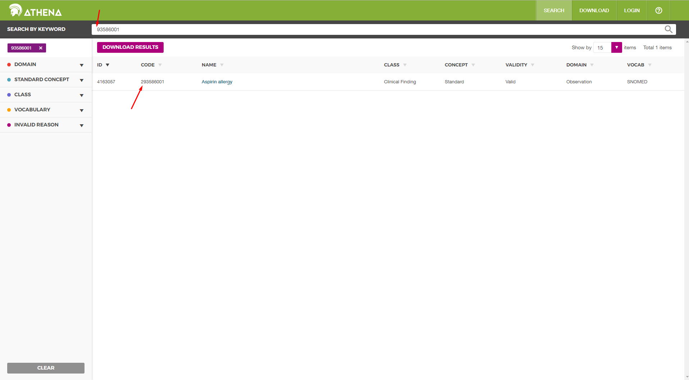

#**How search works**

There are 2 modes of search: exact and non-exact. Both are case insensitive.

### Exact mode
For exact mode you need to enclose your phrase or single word in quotes like this:
1. `"quillaia liquid extract"`
2. `"aspirin"`\
You can combine exact and non-exact words in one phrase:\
`ibuprofen "quillaia liquid extract"`
### Non-exact mode
Brackets "[]", braces "{}" and parentheses "()" are ignored. Results for queries `aspirin` and `(aspirin)` will be the same.\
This kind of search is "fuzzy" which means that synonyms are suggested.\
Example of a query with a typo:\
        `asppirin allergy`\
Results are shown in relevance-descending order:\

Example of a query with partial concept code ("2" is missing):\

        
#### Example of SOLR query:
            
            concept_name_ci:aspirin^9 OR 
            concept_code_ci:aspirin^8 OR 
            id:aspirin^8 OR 
            concept_code:aspirin^8 OR 
            concept_name:aspirin^8 OR 
            concept_class_id:aspirin^8 OR 
            domain_id:aspirin^8 OR 
            vocabulary_id:aspirin^8 OR 
            standard_concept:aspirin^8 OR 
            invalid_reason:aspirin^8 OR 
            concept_synonym_name:aspirin^8 OR 
            concept_name_text:(aspirin~)^7 OR 
                 (concept_name_ci:aspirin^6 OR 
                 concept_name_ci:aspirin~0.6^5 OR 
                 concept_name_text:aspirin^4 OR 
                 concept_name_text:aspirin~^3 OR 
                 concept_code_text:aspirin^3 OR 
                 concept_code_text:*aspirin*^2 OR 
                 query_wo_symbols:aspirin*)

The order of results will be for non-exact mode:

        for the whole phrase in query:
            1) results with exact query string in "concept name" (case insensitive)
            2) results with exact query string  in "concept code" (case insensitive), "id", "concept_code", "concept_name",
               "concept_class_id", "domain_id", "vocabulary_id", "standard_concept", "invalid_reason", "concept_synonym_name"
            3) results with possible typos in "concept name" (case insensitive) plus other words
            
        for split words in query:
            4) results with exact query string (case insensitive) in "concept name"
            5) results with possible typos (case insensitive) in "concept name"
            6) results with exact query string (case insensitive) plus other words in "concept name"
            7) results with possible typos (case insensitive) plus other words in "concept name"
            8) results with exact query string (case insensitive) plus other words in "concept code"
            9) results with partial matching of query string plus other words in "concept code"
            10) results with partial matching of query string (regardless of brackets, parentheses and braces in "non-exact-matching mode") in "query"

For exact mode the order of results and results are the same. Fuzzy results are excluded in this case.

#**Launching tests**

1. Create databases:

    CREATE DATABASE athena_db_test OWNER ohdsi;
    GRANT ALL PRIVILEGES ON DATABASE athena_db_test TO ohdsi;
      
    CREATE DATABASE athena_cdm_v5_test OWNER ohdsi;
    GRANT ALL PRIVILEGES ON DATABASE athena_cdm_v5_test TO ohdsi;

2. Launch any test from `service.concept.nonexact` folder so Flyway migrations will pass

3. Load test data:

    COPY DRUG_STRENGTH FROM 'C:\projects\Athena\src\test\resources\testdata\DRUG_STRENGTH.csv' WITH DELIMITER E'\t' CSV HEADER QUOTE E'\b' ;
    COPY CONCEPT FROM 'C:\projects\Athena\src\test\resources\testdata\CONCEPT.csv' WITH DELIMITER E'\t' CSV HEADER QUOTE E'\b' ;
    COPY CONCEPT_RELATIONSHIP FROM 'C:\projects\Athena\src\test\resources\testdata\CONCEPT_RELATIONSHIP.csv' WITH DELIMITER E'\t' CSV HEADER QUOTE E'\b' ;
    COPY CONCEPT_ANCESTOR FROM 'C:\projects\Athena\src\test\resources\testdata\CONCEPT_ANCESTOR.csv' WITH DELIMITER E'\t' CSV HEADER QUOTE E'\b' ;
    COPY CONCEPT_SYNONYM FROM 'C:\projects\Athena\src\test\resources\testdata\CONCEPT_SYNONYM.csv' WITH DELIMITER E'\t' CSV HEADER QUOTE E'\b' ;
    COPY VOCABULARY FROM 'C:\projects\Athena\src\test\resources\testdata\VOCABULARY.csv' WITH DELIMITER E'\t' CSV HEADER QUOTE E'\b' ;
    COPY RELATIONSHIP FROM 'C:\projects\Athena\src\test\resources\testdata\RELATIONSHIP.csv' WITH DELIMITER E'\t' CSV HEADER QUOTE E'\b' ;
    COPY CONCEPT_CLASS FROM 'C:\projects\Athena\src\test\resources\testdata\CONCEPT_CLASS.csv' WITH DELIMITER E'\t' CSV HEADER QUOTE E'\b' ;
    COPY DOMAIN FROM 'C:\projects\Athena\src\test\resources\testdata\DOMAIN.csv' WITH DELIMITER E'\t' CSV HEADER QUOTE E'\b' ;
    REFRESH MATERIALIZED VIEW concepts_view;`

4. Start SOLR:
    + in `solrconfig.xml` in `<requestHandler name="/dataimport" class="solr.DataImportHandler">` section change 
   `<str name="url">jdbc:postgresql://localhost:5432/athena_cdm_v5</str>` to `<str name="url">jdbc:postgresql://localhost:5432/athena_cdm_v5_test</str>`
   
    + Launch reindex via web-console
    + Restart SOLR container if it is running in Docker
   
5. Launch tests